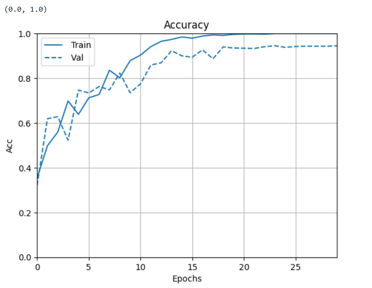
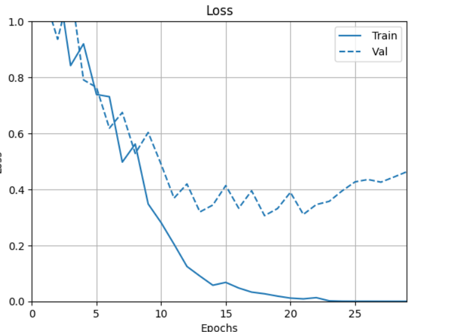
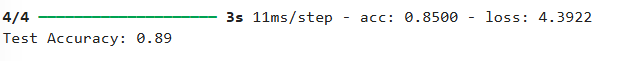
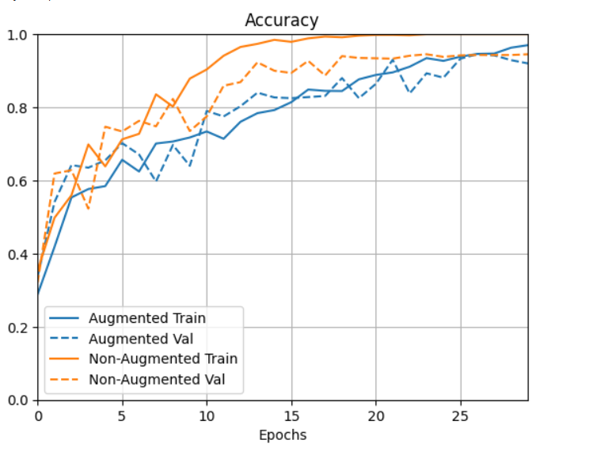
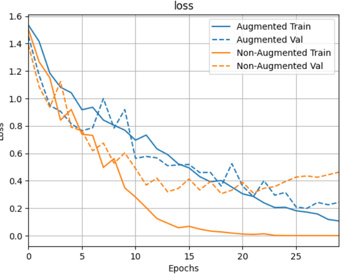
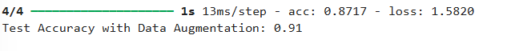

# Road_sign_Recognition [Project Link](https://github.com/remmzytom/Road_sign_Recognition/blob/main/road_sign_recognition.ipynb)

## Scenario

Imagine a situation where self-driving cars or traffic cameras need to identify road signs to make safe and smart decisions. For example, a car must know when to stop at a stop sign, slow down at a speed limit sign, or take caution when it sees a warning sign. To achieve this, a system needs to recognize road signs quickly and accurately, no matter the weather, lighting, or camera quality.

This project solves this problem by building a computer model that can "see" pictures of road signs and understand what they mean. The model is trained using many pictures of road signs, each labeled with its meaning, such as "stop," "50 km/h speed limit," or "no entry." After learning from these examples, the model can recognize and classify new road signs it has never seen before.

This system could be used in self-driving cars, helping them follow traffic rules. It could also support traffic management systems by monitoring signs on highways and urban roads to ensure drivers are obeying rules.

## Project Introduction
This project tackled the challenge of recognizing and classifying road signs using deep learning. By leveraging advanced neural network architectures, the project focused on achieving high accuracy while ensuring the model's ability to generalize across unseen data. This includes addressing noise and variability in the dataset.

## Data Collection
The dataset was created by scraping images from various online sources. These images were curated to include diverse environmental conditions, making the data realistic and challenging. Preprocessing steps, such as resizing, normalization, and augmentation, were applied to prepare the data for training.

## Skillset Used
### The following skills and technologies were utilized in the project:
- Data Collection: Web scraping to gather images and organize them into labeled datasets.
- Python Programming: Writing scripts for data preprocessing, model training, and evaluation.
- Deep Learning: Implementing Convolutional Neural Networks (CNNs) using TensorFlow and Keras.
- Data Augmentation: Applying techniques such as flipping, brightness adjustment, and contrast tuning to enhance the model's generalizability.
- Gradient Norm Penalty (GnP): Enhancing model stability by penalizing large gradients during training.
- Model Optimization: Implementing techniques like gradient norm penalties, dropout layers, and early stopping.
- Visualization Tools: Matplotlib for plotting training metrics and displaying results.
- Evaluation Metrics: Precision score and confusion matrices for performance evaluation.

  

### After apply convolutional Neural network(CNN) on the data and training it with 30 epochs

#### Accuracy graph
With this accuracy plot, it shows that training and validation accuracy over 30 epochs. At the beginning, both training and validation accuracy improve steadily. After around 7 to 10 epochs, the training accuracy continues to increase, but the validation accuracy was kind of fluctuating slightly. With this it shows that the model begin to overfit after around 15 20 epochs. The validation accuracy remains stable but was not improving , while the training accuracy continues to rise, indicating that the model is learning more about the training data but is finding it difficult to generalizing better to unseen data.

#### loss graph
By plotting the loss plot for the above model i was able to get a more view of the model. Which shows how the model's training and validation loss changed over the training epochs.At the start, both the training and validation losses decrease rapidly, which indicates that the model is learning well during the early stages of training. On getting to the 10th epoch, the validation loss starts to fluctuate and later started g increasing after the 15th epoch, while the training loss continues to decrease toward zero.

This behavior indicates overfitting. The model is learning to fit the training data very well, but it is no longer generalizing well to the validation data.

### test accuracy

  

### After applying Data Augumentation

#### Augumented and non-augumented accuracy graph

This graph shows how my model performs with and without data augmentation. For the non-augmented data (orange lines), the model quickly reaches high accuracy but starts overfitting around 10 epochs, which means it perform well on the training data but but not the on validation data. This is a sign that the model is learning too much from the specific training examples without generalizing well.

On the other hand, the augmented data (blue lines) shows more balanced learning. The accuracy improves more slowly and stays stable across both training and validation data around 25 epochs. This indicates that the model generalizes better, even though it takes longer to reach a high level of accuracy.

#### Augument and non- augumented loss graph¶
In this graph the non-augmented data (orange lines), the training loss decreases sharply , showing that the model is quickly learning the training data well. However, at aroun 10 epoch the validation loss starts to fluntuate and later began to increase, indicating overfitting.

For the augmented data (blue lines), the training loss decreases more steadily and does not drop as quickly. The validation loss for the augmented set were more stable, showing less overfitting and better generalization. This indicates that the model was able to learn well for data augmentation

### test accuracy after aplluing transformation

  

## Conclusion
### Achievements
- Successfully developed a robust road sign recognition model using a Convolutional Neural Network (CNN), achieving an initial accuracy of 89% on the test dataset.
- Enhanced the model's performance further by applying advanced data augmentation techniques, improving accuracy by an additional 2%, resulting in a final accuracy of 91%.
- Built and evaluated the model on a diverse dataset collected through web scraping, ensuring it could handle real-world variations like lighting, angles, and image noise.
- Utilized Gradient Norm Penalty (GnP) to improve training stability, leading to better generalization and smoother optimization.
- Demonstrated strong precision across all road sign categories, reinforcing the model's reliability for practical applications.

### Key Insights and Learning Outcomes
- Data Matters: The quality and diversity of the dataset significantly influence the model's performance. Including images from varied conditions made the model more adaptable to real-world use cases.
- Importance of Stability: Techniques like GnP proved essential in ensuring stable training, particularly for complex models and noisy data, leading to smoother optimization and better results.
- Augmentation is Crucial: Applying data augmentation techniques increased the model's robustness and ability to handle unseen scenarios, demonstrating the importance of synthetic data generation.
- Error Analysis Drives Improvement: Analyzing misclassified images revealed weaknesses in the model, which informed adjustments to the data and model architecture.

  

### At a Broad Level
This project highlighted the importance of combining high-quality data collection, advanced deep learning techniques, and rigorous evaluation to build a real-world application. The approach demonstrated how a model could be made robust enough to handle real-world variability, making it suitable for applications like autonomous vehicles and traffic systems. The lessons learned are broadly applicable to building scalable and effective machine learning solutions for diverse problems.

